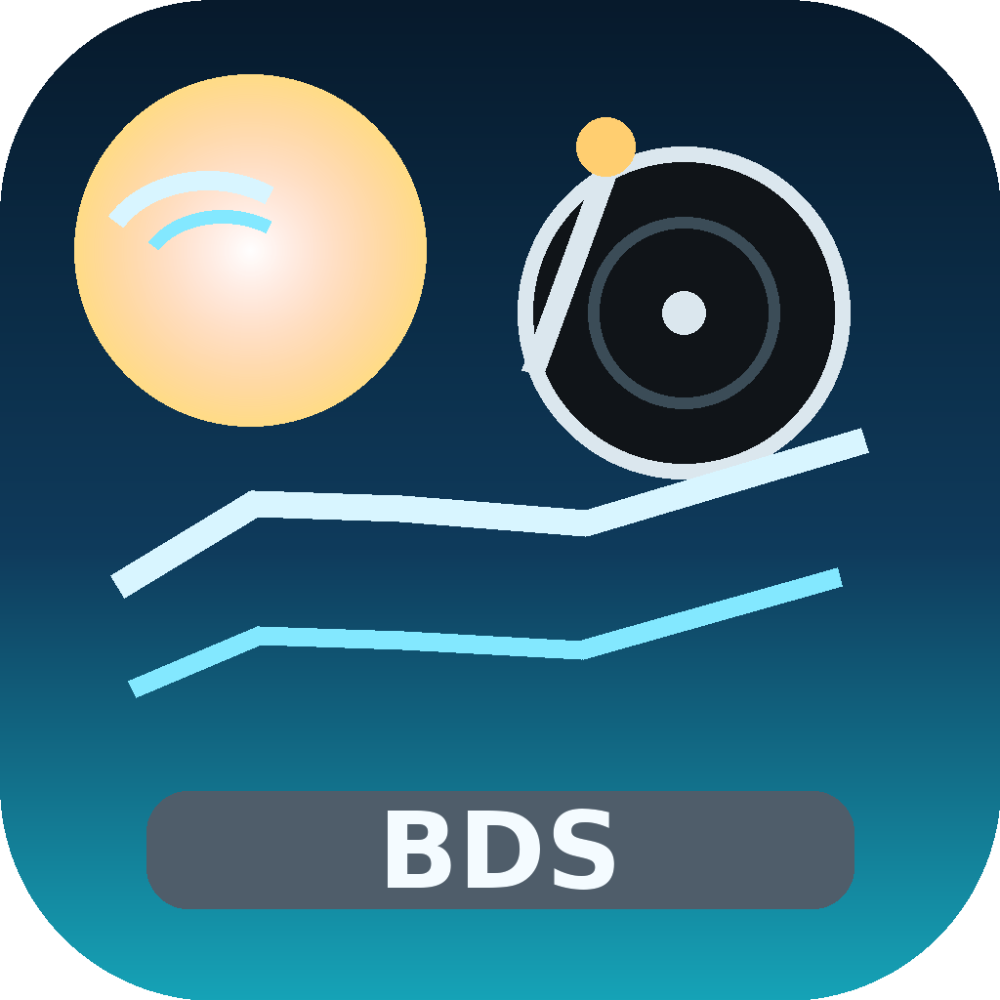

<p align="center">
  
</p>

<h1 align="center">Batida do Sado</h1>

<p align="center">
  <em>My vibe coded attempt at making an updated Deemix alternative. Not bad for a first attempt.</em>
  <br />
  A modern, cross-platform desktop DJ tool da margem do Sado built with Electron, Vue 3, and Vite.
</p>

<p align="center">
  
  
  
  
  
  
</p>

---

## Features

### Music Discovery & Browsing

- **Home Dashboard** -- New releases, top tracks, top albums, and popular playlists at a glance
- **Search** -- Find tracks, albums, artists, and playlists with tabbed result filtering and batch selection
- **Charts** -- Browse global and country-specific charts for tracks, albums, artists, and playlists
- **Artist Pages** -- Full discographies with filters for albums, EPs, singles, compilations, and featured-in releases
- **Album & Playlist Views** -- Track listings with metadata, selective track downloads, and audio previews
- **Link Analyzer** -- Paste any Deezer or Spotify URL to view content details and download directly

### Downloading

- **Audio Formats** -- MP3 128 kbps, MP3 320 kbps, and FLAC (lossless)
- **Batch Downloads** -- Download entire albums, playlists, or select individual tracks
- **Download Queue** -- Pause, resume, reorder (drag-and-drop), cancel, and retry downloads
- **Smart Fallbacks** -- Automatic bitrate and search fallback when preferred quality is unavailable
- **Concurrent Downloads** -- Configurable from 2 to 10 simultaneous downloads
- **Conflict Handling** -- Skip, overwrite, or rename when files already exist

### Metadata & Organization

- **ID3 Tagging** -- 21 configurable tag fields including title, artist, album, lyrics, ISRC, BPM, and more
- **Album Artwork** -- Embedded and local cover art with configurable size and format (JPEG/PNG)
- **Synced Lyrics** -- Optional LRC file generation for synced lyrics
- **Folder Structure** -- Customizable templates for artist, album, playlist, and CD folder organization
- **Track Naming** -- Template-based naming with variables like `%artist%`, `%title%`, `%tracknumber%`

### Spotify Integration

- **Playlist Conversion** -- Convert Spotify playlists to Deezer for downloading
- **Track Matching** -- ISRC-based matching with fallback search and confidence scoring
- **Link Support** -- Paste Spotify URLs directly into the Link Analyzer
- **Batch Downloads** -- Converted playlists download as a single item with unified progress tracking

### Playlist Sync

- **Automatic Sync** -- Monitor Spotify and Deezer playlists for new tracks
- **Scheduling** -- Sync on app launch, hourly, every 6/12/24 hours, or manually
- **Diff-Based Downloads** -- Only downloads tracks added since last sync
- **Settings-Aware** -- Uses your configured quality, folder structure, and metadata settings
- **Real-Time Progress** -- Live progress bars and status updates during sync

### User Experience

- **8 Color Themes** -- Violet, Spotify, Rose, Ocean, Sunset, Mint, Dracula, and Nord
- **Dark / Light / System Mode** -- Follows your OS preference or set manually
- **Slim Sidebar** -- Compact navigation mode for more screen space
- **Keyboard Shortcuts** -- Quick access to search, downloads, settings, and more
- **Search History** -- Recent searches saved for quick access
- **Context Menus** -- Right-click support for copy/paste operations
- **Offline Detection** -- Banner notification when network connectivity is lost
- **Toast Notifications** -- Non-intrusive feedback for all user actions

### Supported Languages

Arabic, Chinese (Simplified & Traditional), Croatian, English, Filipino, French, German, Greek, Indonesian, Italian, Korean, Polish, Portuguese (Brazil & Portugal), Russian, Serbian, Spanish, Thai, Turkish, and Vietnamese

### Security

- **Encrypted Credentials** -- ARL tokens and Spotify secrets stored using Electron safeStorage
- **Path Traversal Protection** -- Download paths validated against directory traversal attacks
- **Session Management** -- Automatic expiration detection and re-authentication

---

## Downloads

Pre-built binaries are available on the [Releases](../../releases) page.

| Platform | Architecture | Formats |
|----------|-------------|---------|
| **macOS** | Universal (Intel + Apple Silicon), ARM64 (Apple Silicon) | `.dmg` |
| **Windows** | x64, ARM64 | `.exe` (Installer), `.exe` (Portable) |
| **Linux** | x64, ARM64 | `.AppImage`, `.deb` |

### Release Files

#### macOS
- `Batida do Sado-{version}-universal.dmg` -- Intel + Apple Silicon
- `Batida do Sado-{version}-arm64.dmg` -- Apple Silicon only

#### Windows
- `Batida do Sado-Setup-{version}-x64.exe` -- Installer (x64)
- `Batida do Sado-Setup-{version}-arm64.exe` -- Installer (ARM64)
- `Batida do Sado-Portable-{version}-x64.exe` -- Portable (x64)
- `Batida do Sado-Portable-{version}-arm64.exe` -- Portable (ARM64)

#### Linux
- `Batida do Sado-{version}.AppImage` -- AppImage (x64)
- `Batida do Sado-{version}-arm64.AppImage` -- AppImage (ARM64)
- `deemix-app_{version}_amd64.deb` -- Debian package (x64)
- `deemix-app_{version}_arm64.deb` -- Debian package (ARM64)

---

## Getting Started

### 1. Install the App

Download the appropriate build for your platform from the [Releases](../../releases) page and install it.

### 2. Log In with Your Deezer ARL Token

A Deezer ARL (Authentication) token is required to download music:

1. Log in to [deezer.com](https://www.deezer.com) in your browser
2. Open Developer Tools (`F12`) and go to the **Application** tab
3. Under **Cookies** > `https://www.deezer.com`, find the `arl` cookie
4. Copy its value and paste it into the app's login dialog

> **Note:** A Deezer Premium or HiFi subscription is required for high-quality downloads (FLAC and 320 kbps).

### 3. Browse, Search, or Paste a Link

Use the search bar, browse charts and new releases, or paste a Deezer/Spotify URL into the Link Analyzer to find music.

### 4. Download

Click the download button on any track, album, or playlist and select your preferred quality.

### Keyboard Shortcuts

| Shortcut | Action |
|----------|--------|
| `Cmd/Ctrl + K` or `Cmd/Ctrl + F` | Focus search |
| `Cmd/Ctrl + D` | Go to downloads |
| `Cmd/Ctrl + ,` | Open settings |
| `Cmd/Ctrl + H` | Go to home |
| `Cmd/Ctrl + /` or `Cmd/Ctrl + Shift + ?` | Show shortcuts help |
| `Escape` | Close modals |

### Spotify Playlist Conversion

1. Go to **Settings** and enter your Spotify API credentials (Client ID and Secret)
2. Navigate to **Link Analyzer**
3. Paste a Spotify playlist or album URL
4. The app matches tracks to Deezer using ISRC codes with search fallback
5. Download the matched tracks

---

## Settings Overview

The Settings page offers deep customization organized into these categories:

| Category | Key Options |
|----------|-------------|
| **Appearance** | Theme (8 color themes), dark/light/system mode, slim sidebar, slim downloads |
| **Downloads** | Quality (128/320/FLAC), max concurrent, overwrite mode, bitrate fallback |
| **Folder Structure** | Create artist/album/playlist/CD folders, customizable folder name templates |
| **Track Naming** | Templates for single tracks, album tracks, and playlist tracks |
| **Metadata Tags** | Toggle 21 individual ID3 tag fields (title, artist, album, lyrics, ISRC, BPM, etc.) |
| **Album Covers** | Save covers, embedded/local artwork size, JPEG quality, PNG option |
| **Text Processing** | Artist separator, date format, featured artists handling, title/artist casing |
| **Language** | Choose from 22 supported languages |
| **Account** | Deezer ARL token management |
| **Spotify** | Client ID, Client Secret, fallback search toggle |
| **Playlist Sync** | Add Spotify/Deezer playlists, set sync schedule, enable/disable |

---

## Building from Source

### Prerequisites

- [Node.js](https://nodejs.org/) 20 or later
- [npm](https://www.npmjs.com/) 9 or later
- [Git](https://git-scm.com/)

### Setup

```bash
git clone https://github.com/DRAZY/deemix-app.git
cd deemix-app
npm install
```

### Development

```bash
# Start the Vite dev server + Electron
npm run electron:dev

# Or start just the Vite dev server (web only)
npm run dev
```

### Build

```bash
# Build for the current platform
npm run build

# Platform-specific builds
npm run build:mac          # macOS Universal (Intel + Apple Silicon)
npm run build:mac-arm64    # macOS Apple Silicon only
npm run build:win          # Windows x64
npm run build:win-arm64    # Windows ARM64
npm run build:linux        # Linux x64
npm run build:linux-arm64  # Linux ARM64

# Build all platforms
npm run build:all
```

Build output is written to the `release/` directory.

---

## Tech Stack

| Layer | Technology |
|-------|-----------|
| **Runtime** | [Electron 35](https://www.electronjs.org/) (Chromium 134, Node.js 22) |
| **Frontend** | [Vue 3](https://vuejs.org/) (Composition API) |
| **Build** | [Vite 6](https://vitejs.dev/) + [vite-plugin-electron](https://github.com/electron-vite/vite-plugin-electron) |
| **Styling** | [Tailwind CSS 3](https://tailwindcss.com/) |
| **State** | [Pinia](https://pinia.vuejs.org/) |
| **Routing** | [Vue Router 4](https://router.vuejs.org/) |
| **i18n** | [Vue I18n 9](https://vue-i18n.intlify.dev/) |
| **Language** | [TypeScript 5](https://www.typescriptlang.org/) |
| **Packaging** | [electron-builder 26](https://www.electron.build/) |
| **HTTP** | [Axios](https://axios-http.com/) |
| **Audio Tags** | [node-id3](https://github.com/Zazama/node-id3), [flac-metadata](https://github.com/claus/flac-metadata) |

---

## Project Structure

```
deemix-app/
├── src/                        # Vue frontend
│   ├── components/             # Reusable UI components (19)
│   ├── composables/            # Composition functions
│   │   ├── useContextMenu.ts       # Right-click menu handling
│   │   ├── useKeyboardShortcuts.ts # Global keyboard shortcuts
│   │   ├── useNetworkStatus.ts     # Online/offline detection
│   │   └── useSearchHistory.ts     # Search history management
│   ├── i18n/locales/           # Translation files (22 languages)
│   ├── services/               # API services
│   │   └── deezerAPI.ts            # Deezer API wrapper with caching
│   ├── stores/                 # Pinia state stores
│   │   ├── authStore.ts            # Authentication & session
│   │   ├── downloadStore.ts        # Download queue management
│   │   ├── favoritesStore.ts       # Favorites tracking
│   │   ├── playerStore.ts          # Audio preview playback
│   │   ├── profileStore.ts         # Settings profiles
│   │   ├── settingsStore.ts        # User preferences
│   │   ├── syncStore.ts            # Playlist sync state
│   │   └── toastStore.ts           # Notification system
│   ├── types/                  # TypeScript type definitions
│   └── views/                  # Page components (11 pages)
├── electron/                   # Electron main process
│   ├── main.ts                 # Window management & IPC
│   ├── preload.ts              # Context bridge
│   ├── server.ts               # Backend server
│   └── services/               # Backend services
│       ├── deezerAuth.ts           # Deezer authentication
│       ├── downloader.ts           # Download engine
│       ├── playlistSync.ts         # Playlist sync engine
│       ├── spotifyAPI.ts           # Spotify API client
│       └── spotifyConverter.ts     # Spotify-to-Deezer conversion
├── public/                     # Static assets & icons
├── dist/                       # Built frontend (generated)
├── dist-electron/              # Built Electron code (generated)
└── release/                    # Packaged builds (generated)
```

---

## Versioning

This project follows [Semantic Versioning](https://semver.org/):

- **PATCH** (e.g., 1.0.1) -- Bug fixes, security patches, dependency updates, translation fixes
- **MINOR** (e.g., 1.1.0) -- New features, new themes, new language support
- **MAJOR** (e.g., 2.0.0) -- Breaking changes, major redesigns, architecture overhauls

See the [Releases](../../releases) page for the full changelog.

---

## Contributing

1. Fork the repository
2. Create a feature branch (`git checkout -b feature/my-feature`)
3. Commit your changes (`git commit -m 'Add my feature'`)
4. Push to the branch (`git push origin feature/my-feature`)
5. Open a Pull Request

Please open an [issue](../../issues) first for major changes to discuss the approach.

---

## License

This project is licensed under the [GPL-3.0 License](LICENSE).

---

## Disclaimer

This application is not affiliated with or endorsed by Deezer or Spotify. Use responsibly and in accordance with your local laws regarding music downloading. Please respect copyright laws and the terms of service of music streaming platforms.

---

<p align="center">
  Made with care by <strong>Charroco</strong>
</p>


## Default customizations
- Default language: Portuguese (Portugal)
- Preferred bitrate: MP3 320kbps
- Playlist track template: %artist% - %title%
